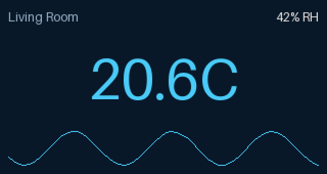
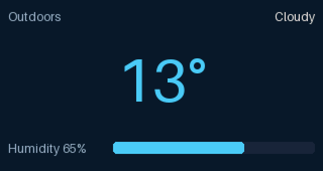
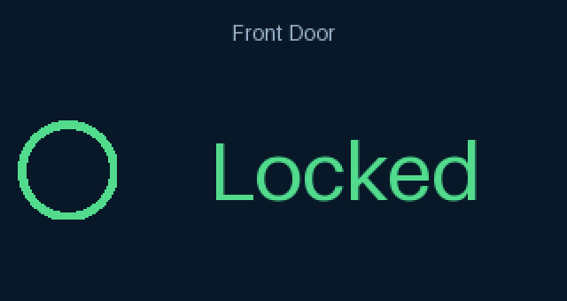
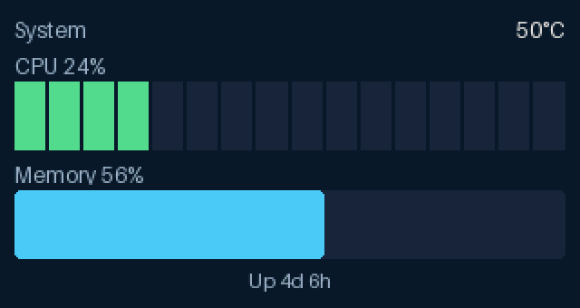
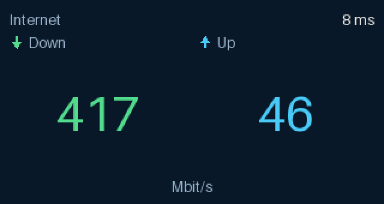
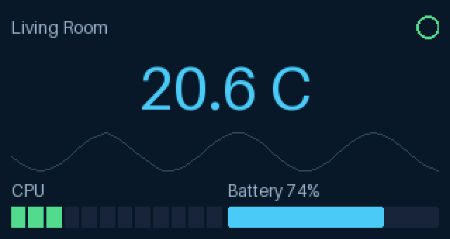

# TinyDisplay

**Lovelace for tiny displays.** A framework for driving small hardware panels
from Home Assistant, with configurable dashboards that are not tied to any one
device.



|  |  |
| --- | --- |
|  |  |
|  |  |

Five screens of [`examples/ha_five_screens.yaml`](examples/ha_five_screens.yaml),
which rotates between them on a timer.

**These are renders, not photographs**, and the difference is only the glass.
Each one comes out of the same `Dashboard.render` the appliance calls, at the
panel's exact 320×170, then through its RGB565 colour depth — so the banding
and the colour shift are real, and a camera would add the bezel and the
backlight and nothing else. [`tools/make_screenshots.py`](tools/make_screenshots.py)
regenerates them.

> **Status: pre-alpha.** All five packages are implemented and tested, and the
> integration is **confirmed on hardware** — an AceMagic S1's built-in panel,
> driven from inside Home Assistant's own Core container, drawing live entity
> state the right way up.
>
> **Installing takes no manual steps.** Add the repository to HACS, download,
> restart, and configure. Home Assistant installs the Python packages itself.
> That has been true since v0.2.1; nothing is copied onto the appliance by
> hand.
>
> **One thing decides whether it works on your machine, and it is not the
> install.** An integration runs in the Core container, which cannot request
> the raw USB privileges an add-on can. Core *can* reach the panel on the one
> machine this has run on; whether yours can is a five-minute check with
> [`tools/ht32_usbfs_preflight.py`](tools/ht32_usbfs_preflight.py), and the
> integration's README opens with it. A failure there is architectural, not a
> setting.
>
> **Not established:** anything about the long run. Uptime beyond minutes,
> reconnection after a replug, the options flow, reload and unload. Those paths
> exist and are unit-tested; none has been exercised against hardware.

## Why

Small displays are everywhere — desk panels, shelf clocks, 3D-printer status
screens — and each one ships with its own bespoke, throwaway firmware. Home
Assistant already knows the state of your house. What is missing is a
*rendering* layer: something that turns entity state into pixels, and that does
not have to be rewritten for the next panel you buy.

TinyDisplay is that layer. The [HT32 panel][ht32] is the first supported
device, not the target.

[ht32]: https://ananthb.github.io/ht32-panel/index.html

## Architecture

Five packages, layered so that each depends only on the ones beneath it, plus a
Home Assistant custom component sitting on top of all of them:

```text
   custom_components/tinydisplay     the only code that imports homeassistant
                |
                v
        Home Assistant               dashboards, entity binding, render loop
                |
                v
            Widgets                  gauges, readouts, charts
                |
                v
             Core                    Widget -> Canvas -> DisplayDriver
             /    \
            v      v
   Hardware drivers   Simulator      HT32, ...        desktop preview
```

The rule that makes this work: **nothing in `core` imports a hardware library,
and nothing in `core` knows Home Assistant exists.** A widget can be rendered
and pixel-asserted with no device attached, and a driver can be exercised with
a canvas it never drew.

| Package | Status | Purpose |
| --- | --- | --- |
| [`packages/core`](packages/core) | **Implemented** | Rendering engine: canvas, widgets, driver abstraction |
| [`packages/simulator`](packages/simulator) | **Implemented** | Desktop preview, no hardware needed |
| [`packages/ht32`](packages/ht32) | **Implemented**, verified on hardware | HT32 panel driver (320x170, RGB565, raw USB) |
| [`packages/widgets`](packages/widgets) | **Implemented** | Layout, labels, gauges, icons, theming |
| [`packages/homeassistant`](packages/homeassistant) | **Implemented**, verified on hardware | YAML dashboards, entity binding, change-driven render loop |
| [`custom_components/tinydisplay`](custom_components/tinydisplay) | **Implemented**, verified on hardware | The custom integration itself |

The last row is separate on purpose. `packages/homeassistant` is a library that
never imports `homeassistant`; the integration that does is a thin adapter over
it, and it sits at the repository root because that is the only place HACS
looks for one.

See [docs/architecture.md](docs/architecture.md) for the reasoning behind the
layering, and [docs/roadmap.md](docs/roadmap.md) for what lands when.

## Quick start

```bash
git clone https://github.com/chad-albrecht/tinydisplay
cd tinydisplay
uv sync
uv run python examples/hello_world.py
```

To see it live, run the simulator and edit the dashboard with the window open:

```bash
uv run python -m tinydisplay.simulator examples/simulator_dashboard.py
```

A dashboard built from the widget library, rather than by hand:

```bash
uv run python -m tinydisplay.simulator examples/widget_dashboard.py
```

A *Home Assistant* dashboard — written as YAML, driven by fake entity state,
with no Home Assistant installed and nothing plugged in:

```bash
uv run python -m tinydisplay.simulator examples/ha_simulator_dashboard.py
```



Edit [`examples/ha_dashboard.yaml`](examples/ha_dashboard.yaml) with the window
open and the panel follows. That the same document drives both this and a real
Home Assistant is the point of the layering — entity state arrives through a
one-method protocol, so a dictionary and `hass.states` are interchangeable.

With an HT32 panel attached, the same drawing code goes to hardware — or to a
recorder, if you want to see the packets without owning one:

```bash
uv run python examples/ht32_panel.py                 # a test pattern
uv run python examples/ht32_widget_dashboard.py      # the dashboard above
uv run python examples/ht32_panel.py --dry-run       # needs nothing
```

Without `uv`:

```bash
python -m venv .venv && . .venv/bin/activate   # .venv\Scripts\activate on Windows
pip install -e packages/core
pip install pytest pytest-asyncio pytest-cov mypy ruff
python examples/hello_world.py
```

Then the API itself:

```python
from tinydisplay.core import Canvas, Color

canvas = Canvas(240, 240)
canvas.clear(Color.BLACK)
canvas.text(x=10, y=10, text="Hello", color=Color.WHITE)
canvas.save("preview.png")
```

[`examples/dashboard.py`](examples/dashboard.py) is a fuller walkthrough: custom
widgets, a container, and a frame pushed through a driver at HT32 resolution.

## Installing in Home Assistant

**Through HACS, as a custom repository, and that is the whole of it.** HACS
copies the integration; Home Assistant installs the Python packages itself,
from this repository's release tarball, because the manifest asks for them by
URL rather than by name. Nothing is installed by hand, and an update through
HACS brings the libraries that version needs — the URLs point at the tag that
shipped it.

Nothing here is published to PyPI, and this is why it does not need to be. A
[PEP 508 direct reference](https://peps.python.org/pep-0508/) installs from a
URL with no index involved, and Home Assistant treats such a requirement as
never-already-satisfied, so a changed URL is always fetched. That is the same
update behaviour publishing would buy.

**A custom repository is where this stays**, and that is a decision rather than
a to-do. Home Assistant's `hassfest` rejects any requirement containing a
space, with no exemption, and a direct reference needs the ` @ ` separator — so
the manifest cannot pass it, and the HACS default store runs it on every
submission. Listing there would mean giving up the install that works to gain
one that is easier to find. Publishing to PyPI would satisfy both and is the
way back if that ever changes.

[`custom_components/tinydisplay/README.md`](custom_components/tinydisplay/README.md)
covers setup, why the manifest lists every package in dependency order, and
what to do when setup reports missing requirements.

Before any of it, on hardware: an integration runs in Home Assistant's **Core**
container, which cannot request the raw USB privileges an add-on can.
[`tools/ht32_usbfs_preflight.py`](tools/ht32_usbfs_preflight.py) establishes
whether the panel is reachable from there, and which interface the driver will
claim. It writes nothing to the panel and is safe on a running system.

## Development

Requires **Python 3.12+**.

```bash
uv sync                 # install the workspace and dev tooling
uv run pytest           # tests, including doctests
uv run ruff check .     # lint
uv run ruff format .    # format
uv run mypy             # type check (strict)
uv run pre-commit install
```

Docstring examples run as part of the suite via `--doctest-modules`, so the
documentation cannot quietly drift from the code.

Standards this repo holds itself to:

- Type hints everywhere; `mypy --strict` passes with no ignores.
- Async only where there is real I/O to await — drivers, not rendering.
- Every public method carries a docstring explaining *why*, not just *what*.

## Design notes

A few decisions worth knowing before reading the code:

- **NumPy owns the framebuffer; Pillow only rasterises.** Glyphs, ellipses and
  image decoding go through Pillow, but the `uint8[H, W, 3]` array is always
  the source of truth, and it is what drivers read.
- **RGB565 lives in core, not in a driver.** Most small panels are 16-bit, so
  `Canvas.to_rgb565()` and `Color.quantized_rgb565()` are part of the engine.
  Endianness is explicit because controllers disagree.
- **Drawing clips; reading raises.** Out-of-bounds draws are silently trimmed
  so widgets need no bounds-checking, but `get_pixel` raises `IndexError`,
  because a silent sentinel there would mask test bugs.
- **Widgets draw in canvas coordinates.** `Widget.draw()` clips to the
  widget's bounds before calling `render()`, so a miscalculating widget cannot
  corrupt its neighbours — and there is no translating-canvas wrapper in the
  hot path.

## Additional documentation and acknowledgments

The HT32 panel ships with no specification. Its wire format was reconstructed
by reading other people's work, and this project would have been considerably
harder — and in places wrong for longer — without theirs.

| Project | Language | What it gave us |
| --- | --- | --- |
| [ananthb/ht32-panel][ht32] ([hardware crate][ht32-hw], [docs][ht32-docs]) | Rust | The primary source for the wire format: packet framing, the 27-chunk redraw, the config and heartbeat commands. Its `Orientation` module later confirmed independently that the panel supports only two hardware orientations and that upside-down is a software rotation. |
| [tjaworski/AceMagic-S1-LED-TFT-Linux][tj] | Node.js | Drives both devices on this exact machine. The source of the `node-hid` + `setDriverType('libusb')` observation that eventually explained why `hidraw` cannot carry a frame, and an independent statement of the five-byte `0xFA` LED protocol. |
| [rojkov/s1display][s1] | C | A libusb-only implementation, and the second piece of evidence that everyone who succeeds with this panel reaches for libusb rather than the kernel's HID path. |
| [fsncps/acemagic-ledctl][ledctl] | Python | A third independent build of the LED packet, byte-for-byte identical to ours — and the restart-to-hold-a-colour technique, which is documented for the ACEMAGIC T9 and does not hold on the S1. |

Two of these corrected us rather than merely informing us, which is worth
saying out loud: reading `ht32-panel` retired a claim in this repository that
the S1 has no interface 1 — it does, and upstream's hard-coded number was right
all along — and `acemagic-ledctl` showed that "the protocol cannot express a
colour" had been over-read into "a colour is impossible".

Project-specific notes live with the code they concern:

- [`packages/ht32/README.md`](packages/ht32/README.md) — the reconstructed wire
  protocol, what each source got wrong, and what hardware bring-up settled.
- [`docs/architecture.md`](docs/architecture.md) — why the packages are layered
  the way they are.
- [`docs/roadmap.md`](docs/roadmap.md) — what landed in each phase, including
  the corrections later phases made to earlier ones.

[ht32]: https://github.com/ananthb/ht32-panel
[ht32-hw]: https://github.com/ananthb/ht32-panel/tree/main/crates/ht32-panel-hw
[ht32-docs]: https://ananthb.github.io/ht32-panel/index.html
[tj]: https://github.com/tjaworski/AceMagic-S1-LED-TFT-Linux
[s1]: https://github.com/rojkov/s1display
[ledctl]: https://github.com/fsncps/acemagic-ledctl

## Licence

[MIT](LICENSE).
